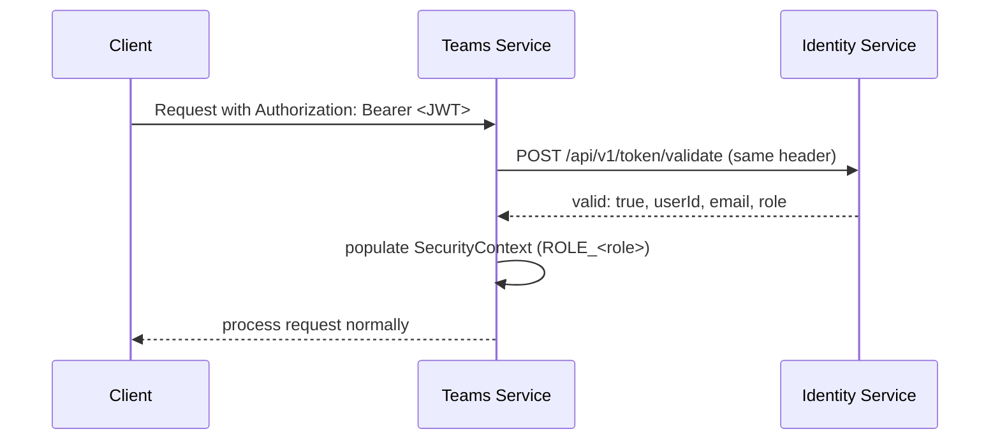

# Architecture

Teams Service follows **hexagonal architecture** (ports and adapters): a
framework-free domain core, use cases in the application layer, and
adapters in infrastructure.

## Layers

```
domain/model/          -> Team, TeamMember, TeamInvitation, CaptaincyTransferRequest, AuditEvent
domain/enums/           -> TeamMemberRole, InvitationStatus, TransferRequestStatus, AuditActionType
domain/exception/       -> Domain exceptions
domain/port/in/          -> Use cases (interfaces)
domain/port/out/         -> Outbound ports (interfaces)

application/usecase/    -> Use case implementations (port/in)

infrastructure/adapter/in/rest/       -> REST controllers, DTOs, global exception handler
infrastructure/adapter/out/persistence/ -> MongoDB adapters
infrastructure/adapter/out/identity/    -> Feign client to Identity Service (JWT validation)
infrastructure/adapter/out/tournament/  -> Feign client to mk-tournament-service
infrastructure/adapter/out/notification/ -> Notification adapter (currently a stub)
infrastructure/config/                 -> Security (JWT filter), Swagger, CORS
infrastructure/mapper/                  -> Domain <-> DTO mappers
```

## Data model

| Entity | Description | Key constraint |
|---|---|---|
| `Team` | A team with name, logo, colors, captain, and member list | name unique platform-wide; `MAX_MEMBERS = 12`; `MIN_MEMBERS_FOR_TOURNAMENT = 7` |
| `TeamMember` | A member of a team, with `TeamMemberRole` (`CAPTAIN` / `PLAYER`) | one entry per `userId` per team |
| `TeamInvitation` | An invitation sent by a captain to a player | `InvitationStatus`: `PENDING` → `ACCEPTED`/`REJECTED`; only one `PENDING` invitation per `(teamId, invitedUserId)` at a time |
| `CaptaincyTransferRequest` | A pending change of captaincy, either captain-initiated or player-applied | `TransferRequestStatus`: `PENDING` → `ACCEPTED`/`REJECTED`; only one `PENDING` request per team at a time |
| `AuditEvent` | A recorded security/audit event for one of the entities above | queryable via `GET /api/v1/audit`, `ADMIN` only |

**Design assumption:** all internal and external identifiers (`teamId`,
`playerId`, `tournamentId`, `captainId`, etc.) are modeled as `UUID`,
matching the convention used across the TechCup platform's own services.

## Security

Unlike Identity Service, Teams Service does not sign or independently
verify JWTs — it has no local `jwt.secret`. `JwtAuthenticationFilter`
forwards the incoming `Authorization` header to Identity Service's
`POST /api/v1/token/validate` on every request (via `IdentityFeignClient`),
and trusts whatever `userId`/`role` comes back to populate the
`SecurityContext`.



**Operational implication:** since this service trusts Identity's response
completely and performs no local signature check, **it depends entirely on
Identity Service's availability** for every protected endpoint. If Identity
is down, authentication fails across the board even though Teams Service
itself is healthy.

Public routes (`SecurityConfig.PUBLIC_ENDPOINTS`, plus three explicit
service-to-service routes) and CSRF/CORS configuration are detailed in
[Appendices](anexos.md#security-notes).

## Integrations with other microservices

| Port | Package | Use | Style |
|---|---|---|---|
| `IdentityTokenValidationPort` | `adapter.out.identity` | Validate a JWT on every authenticated request | Synchronous REST (blocking) |
| `TournamentServicePort` | `adapter.out.tournament` | List a tournament's teams, enroll a team, check active-enrollment status | Synchronous REST (blocking) |
| `NotificationPort` | `adapter.out.notification` | Notify players of invitations and captaincy-transfer requests/responses | Currently a logging **stub** — no real outbound call yet |

**Why this combination:** Identity and Tournament resolve data Teams needs
*before* it can accept an operation (is this token valid? does this
tournament have room?), so they fit naturally as synchronous request/response
calls. Notifications are inherently fire-and-forget from Teams' perspective
— a failure to notify shouldn't block or reverse an already-persisted
invitation or transfer — which is why `NotificationPort` is modeled
separately, even though its current implementation doesn't yet make a real
call anywhere (see [Appendices](anexos.md) for the detail).

### Failure behavior per integration

| Service | If unreachable |
|---|---|
| Identity Service | The request fails to authenticate (falls through as anonymous → `401`/`403` downstream) |
| mk-tournament-service | `TournamentServiceUnavailableException` → `502` on enroll/list; the active-tournament check instead **fails open**, returning `false` |
| Communications | N/A today — the stub adapter never fails, since it never actually calls out |

See [API](api.md) for the full endpoint reference and [Requirements](requerimientos.md) for which TC items each integration supports.
